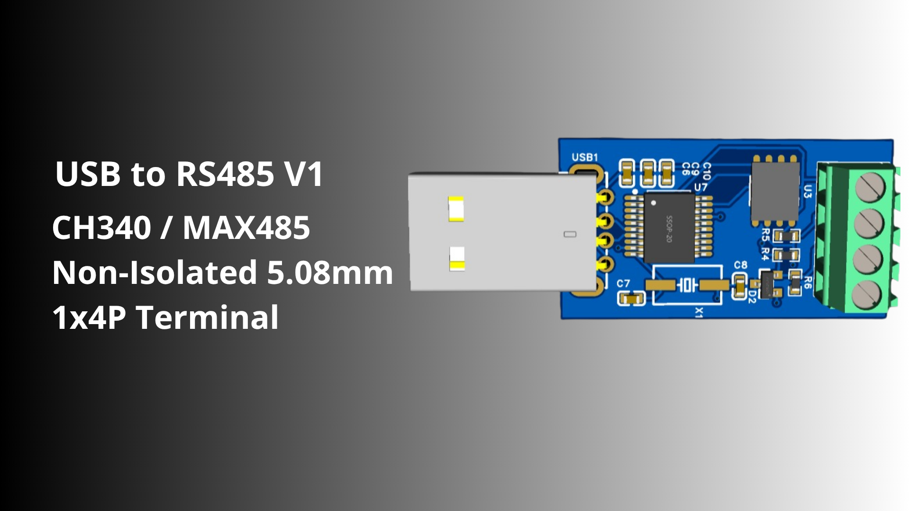

# USB to RS485 V1 Converter



Modul konverter USB ke RS485 ekonomis dan andal menggunakan kombinasi IC CH340 dan MAX485 untuk kebutuhan komunikasi serial industri, otomatisasi, dan pembacaan sensor (seperti protokol Modbus).

## Spesifikasi Teknis

### CH340 USB to Serial
* **Interface:** Antarmuka perangkat USB Full-speed, kompatibel penuh dengan USB 2.0.
* **Baud Rate:** Mendukung kecepatan komunikasi data (baud rate) dari 50bps hingga 2Mbps.
* **Driver:** Menggunakan driver CH340 standar yang kompatibel dengan Windows, Linux, dan macOS.

### RS485 Transceiver (MAX485)
* **Kecepatan Maksimal:** Hingga 2.5Mbps (Kecepatan operasional stabil yang disarankan: 115.2kbps).
* **Level Tegangan:** 5V TTL / RS485 Level.
* **Tipe Isolasi:** Non-Isolated (GND terhubung langsung).
* **Fitur Tambahan:** Dilengkapi dengan resistor terminator bawaan untuk menjaga stabilitas sinyal pada jalur komunikasi jarak jauh.

### Konektor & Fisika
* **Tipe Terminal:** Terminal Blok Sekrup 5.08mm 1x4P (Tipe 128-5.08).
* **Konfigurasi Pin:** Menyediakan akses untuk pin VCC (5V), GND, A (485+), dan B (485-).

---

## Instalasi Driver

Untuk menggunakan modul ini, pastikan Anda sudah menginstal driver CH340 di komputer Anda.
* Silakan cek folder `Drivers` di dalam repository ini untuk installer driver yang sesuai dengan sistem operasi Anda.

---

## Kontak & Tautan
```text
/*------------------------------------------------
- Developer: ellennfrds11
- GitHub: [github.com/ellennfrds11](https://github.com/ellennfrds11)
- Project: USB2RS485-Hardware-Design
------------------------------------------------*/
